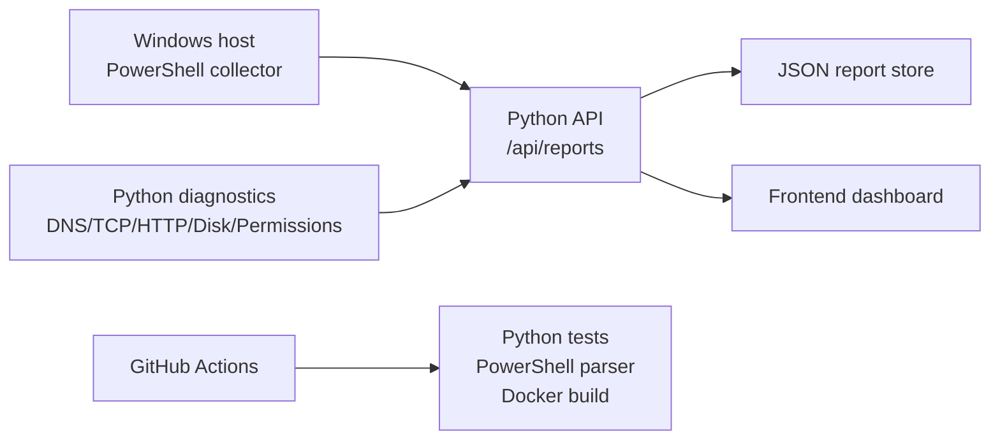

# Windows Fleet Health & PowerShell Automation Toolkit

A complete operations toolkit for collecting Windows host health, running repeatable infrastructure diagnostics, and visualizing fleet status in a clean browser dashboard.

## What It Does

- Collects Windows CPU, memory, OS, service, DNS, TCP, and HTTP endpoint signals with PowerShell.
- Exposes a Python backend API for report ingestion, live diagnostics, and fleet summaries.
- Provides a responsive frontend dashboard for host health, failed services, and automated checks.
- Adds automated checks for DNS resolution, TCP connectivity, HTTP endpoints, disk thresholds, and file permissions.
- Includes Docker, GitHub Actions, tests, sample payloads, and operational documentation.

## Architecture



## Quick Start

Frontend preview from GitHub Pages:

```text
https://vimlendusharma.github.io/CLOUD-AUTOMATION-TOOLKIT/
```

The GitHub Pages preview uses built-in demo data because the static hosting layer does not run the Python API. For live collector data, run the backend locally or in Docker.

```bash
cd windows-fleet-health-toolkit
PYTHONPATH=backend python3 -m fleet_health.app
```

Open `http://localhost:8080`.

Load the sample report:

```bash
curl -X POST http://localhost:8080/api/reports \
  -H "Content-Type: application/json" \
  --data @sample-data/report.json
```

Run diagnostics:

```bash
python3 scripts/python/run_checks.py --api http://localhost:8080
```

## Windows Collector

Run from a Windows host with PowerShell 7 or Windows PowerShell:

```powershell
.\scripts\powershell\Collect-FleetHealth.ps1 `
  -ApiUrl "http://YOUR-SERVER:8080/api/reports" `
  -Endpoint "https://github.com"
```

The collector sends:

- CPU load percentage
- Memory usage percentage
- OS caption
- Required Windows service states
- HTTP endpoint check
- DNS resolution check
- TCP connectivity check

## Docker

```bash
docker compose up --build
```

The dashboard and API are available on `http://localhost:8080`.

## API

| Method | Path | Purpose |
| --- | --- | --- |
| `GET` | `/api/health` | Service liveness |
| `GET` | `/api/fleet` | Fleet summary and latest report per host |
| `GET` | `/api/checks` | Run default diagnostics |
| `POST` | `/api/checks` | Run diagnostics from a JSON config |
| `POST` | `/api/reports` | Ingest a Windows host report |

Example report:

```json
{
  "hostname": "WIN-OPS-001",
  "cpu_percent": 38.5,
  "memory_percent": 64.1,
  "failed_services": 0,
  "checks": []
}
```

## GitHub Actions

The workflow in `.github/workflows/ci.yml` runs:

- Python compilation
- Unit tests with `unittest`
- PowerShell parser validation on Windows
- Docker image build

## Why This Stack

**PowerShell for Windows collection:** it is native to Windows administration, has first-class access to CIM/WMI, services, DNS tools, and REST APIs.

**Python for backend and diagnostics:** Python is portable across Linux, Docker, and CI, and is excellent for network checks, filesystem checks, JSON APIs, and automation glue.

**Standard-library backend:** this project stays dependency-light, which makes it easy to run in locked-down environments and simple to audit.

**Static frontend:** the dashboard loads fast, avoids a build step, and is easy to serve from the same backend container.

**Docker:** Docker packages the API and dashboard into a repeatable Linux deployment target.

**GitHub Actions:** CI proves scripts parse, tests pass, and the container builds before changes are merged.

## Debugging

- API not starting: confirm `PYTHONPATH=backend` is set when running from source.
- Empty dashboard: POST `sample-data/report.json` to `/api/reports`.
- Failed DNS/TCP/HTTP checks: verify outbound network access from the machine or container.
- PowerShell collector fails on services: adjust `-RequiredServices` for your Windows image.
- Disk check fails in Docker: inspect the mounted volume and host disk capacity.

## Project Layout

```text
backend/fleet_health/       Python API, storage, and diagnostics
frontend/                   Static operations dashboard
scripts/powershell/         Windows host collector
scripts/python/             Cross-platform diagnostic runner
tests/                      Unit tests
.github/workflows/          CI checks
docs/                       Additional project notes
sample-data/                Example host report
```
